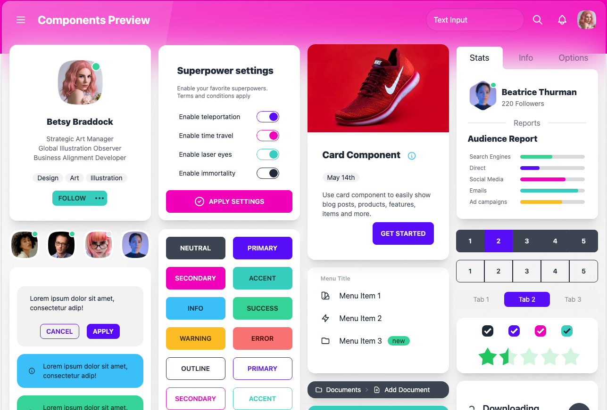
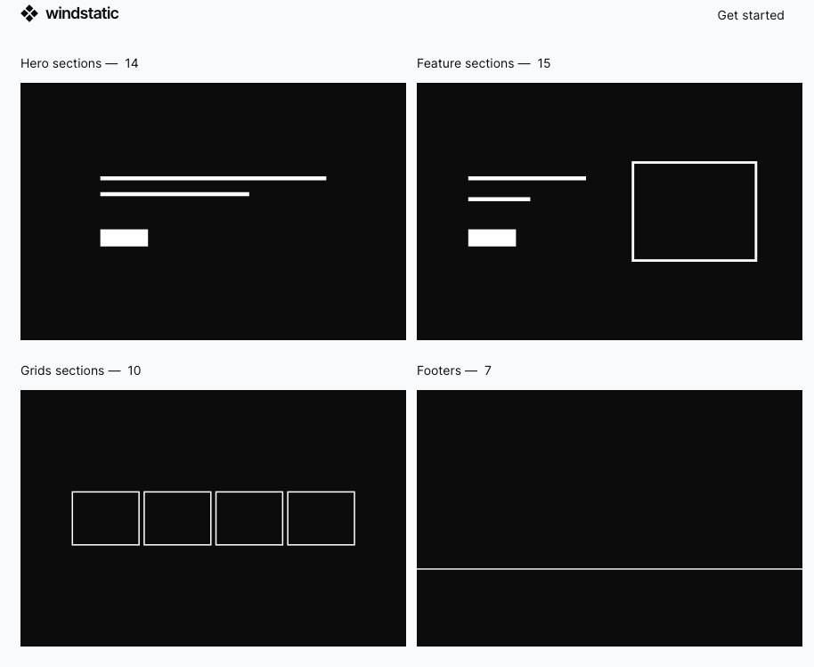
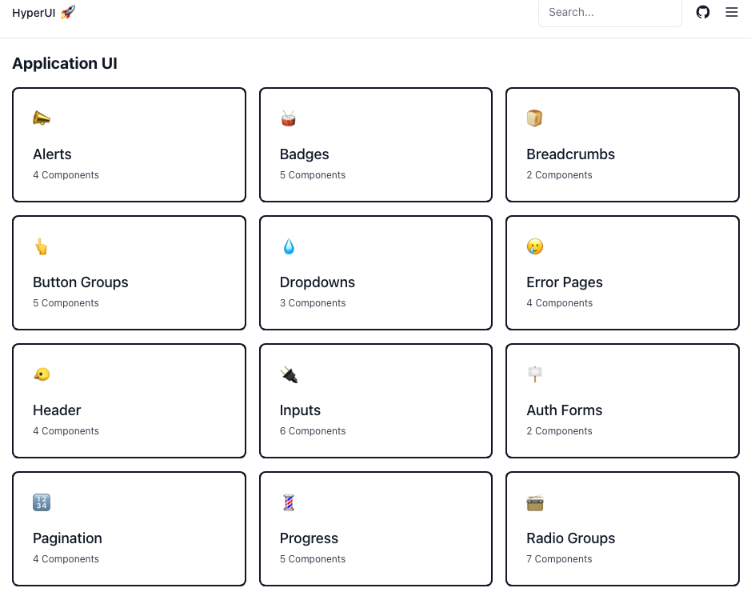
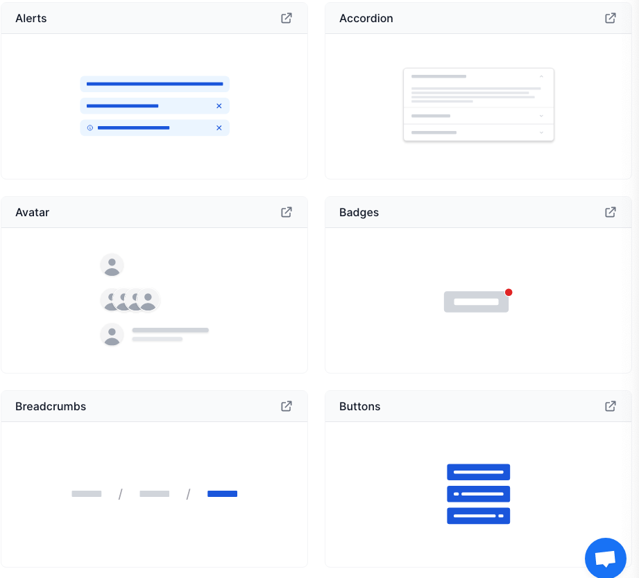
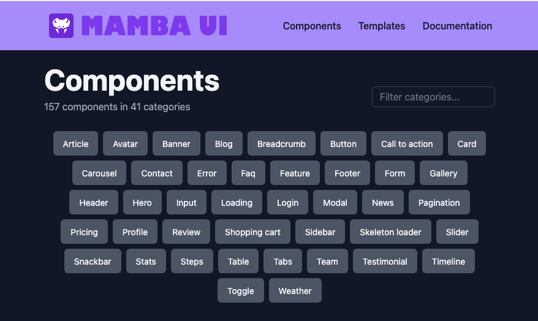
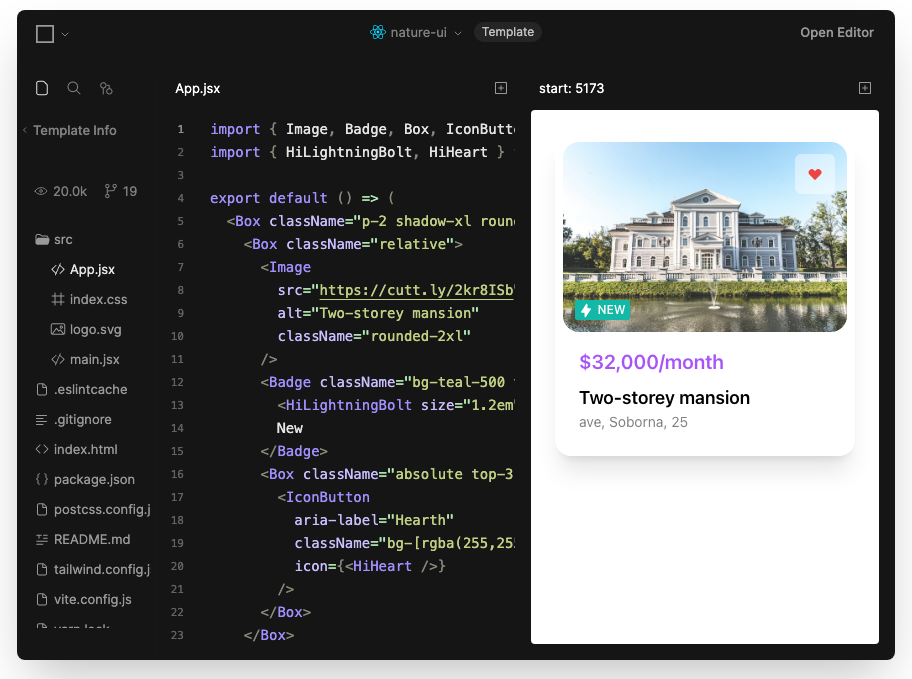
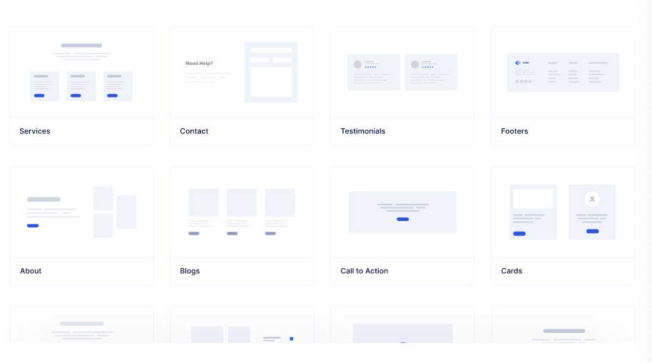
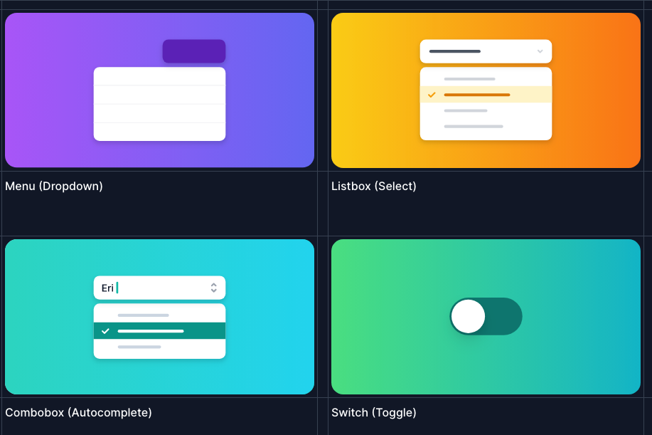

import { hamzamousa } from '@/authors'
import twitterCard from './daisyUI.png'

export const meta = {
title: '11 开源免费的基于 TailwindCSS 的 UI 插件和框架',
description: `Tailwind是一个实用优先的CSS框架，可以帮助开发人员创建响应式和可扩展的用户界面。它的目的是通过提供可轻松应用于标记的预定义类来简化HTML元素的样式化过程。`,
date: '2023-05-14T14:00:00.000Z',
authors: [hamzamousa],
image: twitterCard,
}

| ui           | star                |
| ------------ | ------------------- |
| [daisyUI]    | ![daisyui-stars]    |
| [headlessui] | ![headlessui-stars] |
| [hyperui]    | ![hyperui-stars]    |
| [preline]    | ![preline-stars]    |
| [flowbite]   | ![flowbite-stars]   |
| [TailGrids]  | ![TailGrids-stars]  |
| [mambaui]    | ![mambaui-stars]    |
| [a17t]       | ![a17t-stars]       |
| [natureui]   | ![natureui-stars]   |

[preline]: https://github.com/htmlstreamofficial/preline
[preline-stars]: https://img.shields.io/github/stars/htmlstreamofficial/preline?style=social
[TailGrids]: https://github.com/TailGrids/tailwind-ui-components
[TailGrids-stars]: https://img.shields.io/github/stars/TailGrids/tailwind-ui-components?style=social
[headlessui]: https://github.com/tailwindlabs/headlessui/
[headlessui-stars]: https://img.shields.io/github/stars/tailwindlabs/headlessui?style=social
[flowbite]: https://github.com/themesberg/flowbite-react
[flowbite-stars]: https://img.shields.io/github/stars/themesberg/flowbite-react?style=social
[hyperui]: https://github.com/markmead/hyperui
[hyperui-stars]: https://img.shields.io/github/stars/markmead/hyperui?style=social
[mambaui]: https://github.com/Microwawe/mamba-ui
[mambaui-stars]: https://img.shields.io/github/stars/Microwawe/mamba-ui?style=social
[natureui]: https://github.com/Nature-UI/nature-ui
[natureui-stars]: https://img.shields.io/github/stars/Nature-UI/nature-ui?style=social
[a17t]: https://github.com/milesmcc/a17t/
[a17t-stars]: https://img.shields.io/github/stars/milesmcc/a17t?style=social
[daisyUI]: https://github.com/saadeghi/daisyui
[daisyui-stars]: https://img.shields.io/github/stars/saadeghi/daisyui?style=social

> https://medevel.com/11-tailwind-frameowkrs/#:~:text=11%20Open-source%20Free%20TailwindCSS%20Based%20UI%20Plugins%20and,Nature%20UI%20...%208%208-%20TailGrids%20...%20%E6%9B%B4%E5%A4%9A%E9%A1%B9%E7%9B%AE

Tailwind 是一个实用优先的 CSS 框架，可以帮助开发人员创建响应式和可扩展的用户界面。它的目的是通过提供可轻松应用于标记的预定义类来简化 HTML 元素的样式化过程。

顺风车的关键优势在于它的灵活性。它允许开发人员无需编写任何 CSS 代码即可创建自定义设计。相反，开发人员可以利用 Tailwind 广泛的预构建 CSS 类库。

它是一个强大的 CSS 框架，通过其广泛的预定义类库简化了 HTML 元素的样式化过程。有了 Tailwind，开发人员可以毫不费力地制作定制设计，而无需编写任何 CSS 代码，节省了时间和精力。其模块化架构还可以实现高效的性能优化和文件大小减小，使其成为任何项目的理想选择。

## 特点及优势

Tailwind 的另一个优势是它的模块化方法。有了 Tailwind，开发人员可以选择他们想要使用的功能，而不是被迫使用单一的框架。这使得优化性能和减小文件大小变得更加容易。

Tailwind 的其他功能包括:

1. **响应设计**: Tailwind 的响应式设计类可以轻松创建适应不同屏幕尺寸的流畅和响应式布局。
2. **定制**: Tailwind 是高度可定制的，允许开发人员轻松创建自定义主题或修改现有主题。
3. **浏览器兼容性**: Tailwind 是为现代浏览器设计的，但它也包括旧浏览器的备用功能。
4. **文档**: Tailwind 的文档非常丰富，使开发人员可以轻松地学习和实现该框架。

总之，Tailwind 是一个灵活的模块化 CSS 框架，它简化了 HTML 元素的样式化过程。它的主要优点包括灵活性、模块化和广泛的预构建 CSS 类库。它的特性包括响应式设计、自定义、浏览器兼容性和全面的文档。

## 1. daisyUI

[daisyUI](https://daisyui.com/)

daisyUI 是一个免费的开源顺风 CSS 插件，具有丰富的现成组件集。它提供了一个更快的开发，干净的 HTML，精简的 CSS，和十几个主题可供选择。

daisyUI，具有响应式布局支持，以及许多花哨的 UI 工具，如导航，模态，布局，下拉，画板，抽屉，她，堆栈，蒙版等。

## 2.Wind Static

[Wind Static](https://windstatic.com/)

Wind Static 是使用 Tailwind CSS 和 Alpine.js 制作的包含 161 个元素和布局的 WIP(工作在进行中)集。

## 3.Preline UI

[Preline UI](https://preline.co/)

Preline UI 是一组基于实用优先的顺风 CSS 框架的预构建 UI 组件的开源集合。基于顺风 CSS 实用工具类，Preline UI 的预构建组件和 UI 元素可以帮助您快速设计和定制响应式移动优先网站，其中包含网站所需的组件，包括按钮，下拉菜单，导航栏，模态等等。

Preline UI 可用于 React, Vue 和 HTML。

## 4.HyperUI

[HyperUI](https://www.hyperui.dev/)

HyperUI 是一个免费的顺风 CSS 组件集合，可以在您的下一个项目中使用。有了一系列的组件，你可以建立你的下一个营销网站，管理仪表板，电子商务商店和更多。

## 5.Flowbite

[Flowbite](https://flowbite.com/)

Flowbite 是一个开源的 UI 组件库，基于实用程序优先的顺风 CSS 框架，具有暗模式支持，Figma 设计系统，模板等。

它包含了网站所需的所有常用组件，比如按钮、下拉菜单、导航栏、模态，还有一些更高级的交互元素，比如日期选择器。

## 6.Mamba UI

[Mamba UI](https://mambaui.com/)

Mamba UI 是一个免费的、开源的 UI 组件和模板集合，基于顺风 CSS。

## 7.Nature UI

[Nature UI](https://github.com/Nature-UI/nature-ui)

自然 UI 提供了一组可访问、可重用、可扩展和可组合的 React 组件，使使用顺风 CSS 创建网站和应用程序变得超级容易。

## 8.TailGrids

[TailGrids](https://tailgrids.com/)

准备使用顺风 CSS UI 工具包组件，模块，部分和模板，专门为 Web 应用程序，营销，电子商务，仪表板等制作。

500+多用途，免费和优质的顺风 UI 组件，您可以复制粘贴，也使您能够构建高质量的自定义网站界面。例如数据丰富的仪表板、电子商务商店、web 应用程序用户界面、高转换的登陆页面、完整的网站前端、网站模板等等，而无需从头开始编码或设计。

## 9.Headless UI

[Headless UI](https://headlessui.com/)

完全无样式，完全可访问的 UI 组件，旨在与 React 和 Vue 的顺风 CSS 完美集成。

## 10.a17t

[a17t](https://a17t.miles.land/)

a17t 是一个顺风 CSS 插件，它以一种中性的设计语言提供了像字段、按钮和卡片这样的原子组件，可以随着项目的扩展而扩展。

## 11.Kometa UI Kit

[Kometa UI Kit](https://kitwind.io/products/kometa)

Kometa UI Kit 为 HTML、Vue.js 和 React 提供了 130 个免费的组件，这些组件是基于顺风 CSS 构建的。
